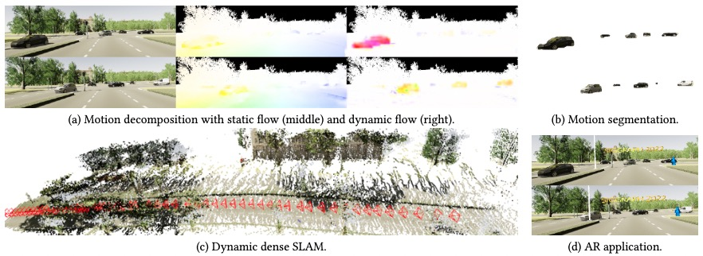

# DeFlowSLAM: Self-Supervised Scene Motion Decomposition for Dynamic Dense SLAM
### [Project Page](https://zju3dv.github.io/deflowslam/) | [Paper](https://arxiv.org/abs/2207.01610)
<br/>

> DeFlowSLAM: Self-Supervised Scene Motion Decomposition for Dynamic Dense SLAM  

> [Weicai Ye](https://ywcmaike.github.io/), [Xinyuan Yu](https://github.com/RickyYXY), [Xinyue Lan](https://github.com/siyisan), [Yuhang Ming](https://github.com/YuhangMing), [Jinyu Li](https://jinyu.li/), [Hujun Bao](http://www.cad.zju.edu.cn/home/bao/), [Zhaopeng Cui](https://zhpcui.github.io/), [Guofeng Zhang](http://www.cad.zju.edu.cn/home/gfzhang)

> Arxiv 2022



## Brewing🍺, code coming soon.
## Citation

If you find this code useful for your research, please use the following BibTeX entry.

```bibtex
@article{Ye2022DeFlowSLAM,
    title={DeFlowSLAM: Self-Supervised Scene Motion Decomposition for Dynamic Dense SLAM  
},
    author={Ye, Weicai and Yu, Xinyuan and Lan, Xinyue and Ming, Yuhang and Li, Jinyu and Bao, Hujun and Cui, Zhaopeng and Zhang, Guofeng},
    booktitle={arxiv}, 
    year={2022}
  }
```